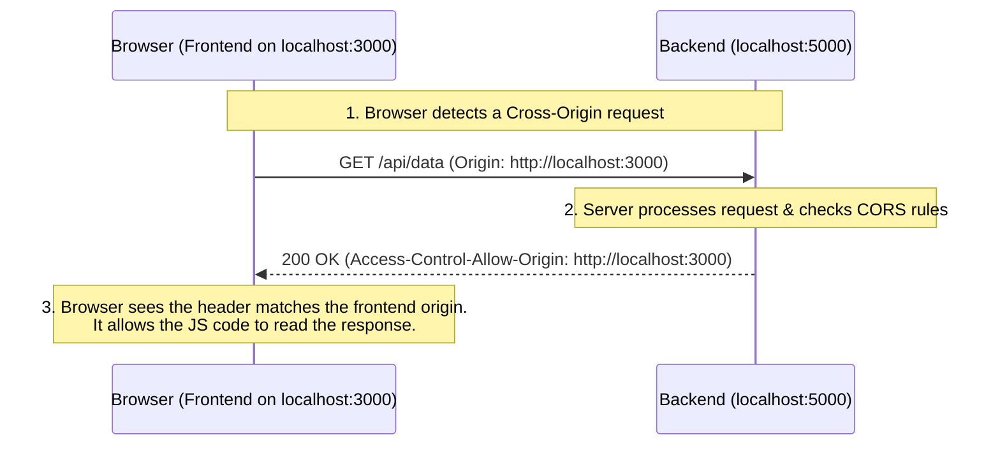
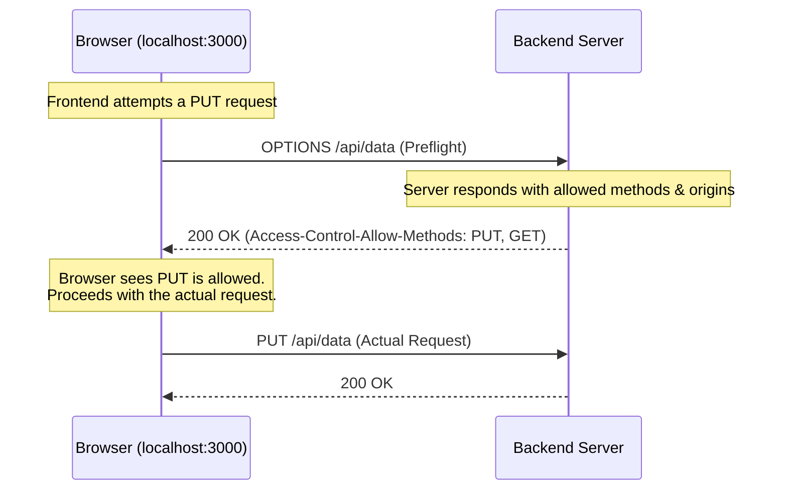

## Introduction

If you are a web developer, you have almost certainly encountered a wall of red text in your browser console that looks like this:

`Access to fetch at 'http://localhost:5000/api/data' from origin 'http://localhost:3000' has been blocked by CORS policy: No 'Access-Control-Allow-Origin' header is present on the requested resource.`

CORS (Cross-Origin Resource Sharing) is one of the most common stumbling blocks for developers. It is often misunderstood as a strict server-side configuration that "blocks" requests. In reality, CORS is a security mechanism enforced by the **browser**, designed to protect users.

This guide breaks down exactly what CORS is, why it exists, and how to properly configure it.

## The Browser Security Model: Same-Origin Policy

To understand CORS, you must first understand the rule it is relaxing: the **Same-Origin Policy (SOP)**.

The Same-Origin Policy is a fundamental security mechanism. It dictates that a web browser permits scripts contained in a first web page to access data in a second web page, but *only if both web pages have the same origin*.

Imagine if you were logged into your bank account on one tab (`bank.com`), and in another tab, you visited a malicious site (`evil.com`). Without the Same-Origin Policy, a script running on `evil.com` could make a background request to `bank.com/api/transfer` and easily drain your account. The SOP prevents this by ensuring `evil.com` cannot read data from or interact with `bank.com`.

### What defines an "Origin"?

An origin is defined by a combination of three elements:
1. **Protocol (Scheme):** e.g., `http://` or `https://`
2. **Domain (Host):** e.g., `localhost` or `api.example.com`
3. **Port:** e.g., `:3000` or `:5000` (implicitly `:80` for HTTP and `:443` for HTTPS)

If *any* of these three elements differ, the browser considers it a **Cross-Origin** request.

*Example:*
- `http://localhost:3000` to `http://localhost:3000/api` -> **Same-Origin**
- `http://localhost:3000` to `http://localhost:5000/api` -> **Cross-Origin** (Different port)
- `https://example.com` to `https://api.example.com` -> **Cross-Origin** (Different domain/subdomain)

## How CORS Works: The Diagram

When your frontend needs to talk to a backend on a different origin, the Same-Origin policy normally blocks it. **CORS** is the protocol that allows the backend server to explicitly tell the browser: *"It's okay, I trust this specific frontend to talk to me."*

Here is a visual breakdown of a typical cross-origin request:

If the server did *not* return the `Access-Control-Allow-Origin` header (or if the header didn't match the frontend's origin), the browser would receive the response but **hide the data** from the frontend JavaScript, throwing the infamous CORS error instead.

## Preflight Requests (The OPTIONS Request)

For simple requests (like a standard `GET` or `POST` with basic headers), the browser sends the request immediately and checks the CORS headers on the response. 

However, for requests that could potentially modify server data or use custom headers (e.g., `PUT`, `DELETE`, or requests with an `Authorization` or `Content-Type: application/json` header), the browser wants to be extra safe. It sends a "Preflight" request first.

A **Preflight Request** uses the HTTP `OPTIONS` method. It is the browser's way of asking the server for permission *before* sending the actual data.

If your server does not properly handle `OPTIONS` requests and return the correct CORS headers, the preflight fails, and the actual `PUT` or `DELETE` request is never even sent.

## Common Misconceptions

### 1. "CORS protects my server from unauthorized access."
**False.** CORS protects the *user*, not the server. Postman, curl, or a python backend script completely ignore CORS policies. If you use Postman to hit your API, it will work perfectly, leading to the frustrated developer cry: *"It works in Postman but not in my browser!"* This is because Postman is a direct client, not a browser enforcing the Same-Origin Policy. To secure your server, use authentication (like JWT or Sessions), not CORS.

### 2. "I should just set `Access-Control-Allow-Origin: *` to fix the error."
**Dangerous.** While `*` works for public APIs (like a weather API), you should never use it for an API that handles sensitive, authenticated user data. If you use `*`, any malicious site can make requests to your API on behalf of the user. Always specify the exact domain (e.g., `https://my-frontend.com`).

### 3. "The browser is blocking the request from reaching the server."
**Mostly False.** For "simple" requests (like a standard GET), the request actually *does* reach the server. The server processes it and sends the data back. The browser simply intercepts the response and refuses to hand the data over to the JavaScript code because the CORS headers are missing. (Note: Preflight requests *do* block the actual request until permission is granted).

## Conclusion

CORS doesn't have to be a nightmare. By remembering that CORS is a browser-enforced security mechanism (SOP) and that your server simply needs to explicitly whitelist your frontend's origin via HTTP headers, you can debug those red console errors with confidence.
